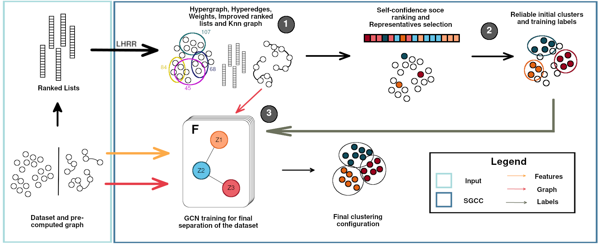

# Self-Supervised Clustering Based on Manifold Learning and Graph Convolutional Networks (SGCC)

This repository contains Python code for the Self-Supervised Graph Convolutional Clustering (SGCC) paper.

## Abstract

> In spite of the huge advances in supervised learning, the common requirement for extensive labeled datasets represents a severe bottleneck. In this scenario, other learning paradigms capable of addressing the challenge associated with the scarcity of labeled data represent a relevant alternative solution. This paper presents a novel clustering method called Self-Supervised Graph Convolutional Clustering (SGCC), which aims to exploit the strengths of different learning paradigms, combining unsupervised, semi-supervised, and self-supervised perspectives. An unsupervised manifold learning algorithm based on hypergraphs and ranking information is used to provide more effective and global similarity information. The hypergraph structures allow identifying representative items for each cluster, which are used to derive a set of small but high confident clusters. Such clusters are taken as soft-labels for training a Graph Convolutional Network (GCN) in a semi-supervised classification task. Once trained in a self-supervised setting, the GCN is used to predict the cluster of remaining items. The proposed SGCC method was evaluated both in image and citation networks datasets and compared with classic and recent clustering methods, obtaining high-effective results in all scenarios.

## Introduction

The **SGCC** method is composed of three main steps, as displayed in the image below:



1. **Manifold Learning Step**: First, the [LHRR](https://ieeexplore.ieee.org/document/8733193/) method is applied to retrieve the constructed hypergraph, better similarity scores between elements, and a better set of ranked lists for the data.
2. **Initial Clustering Step**: The retrieved data is used to elected a series of leaders (one for each desired cluster) and to clusterize a portion of the dataset (later used as soft-labels)
3. **GCN step**: Using the soft-labels obtained from the last step, a GCN is trained in a semi-supervised manner. After training, the GCN is used to separate the complete dataset into the desired clusters.

For more information on this project, please read our [complete paper and supplementary material](https://openaccess.thecvf.com/content/WACV2023/html/Lopes_Self-Supervised_Clustering_Based_on_Manifold_Learning_and_Graph_Convolutional_Networks_WACV_2023_paper.html).

## Instalatioin

To run SGCC, please make sure [docker](https://docs.docker.com/engine/install/), [NVIDIA container toolkit](https://docs.nvidia.com/datacenter/cloud-native/container-toolkit/install-guide.html) and a proper GPU are configured in your host machine.

Afterwards, build our preconfigured docker image using the following command inside the project's root folder:

```shell
docker build -t sgcc_image:latest .
```

After building, run a new container using the following code:

```shell
docker run --gpus all --name sgcc_container -it sgcc_image:latest
```

Inside the docker image, please build the `LHRR` Cython code using the `make`command inside the `/workspaces/sgcc` folder:

```shell
make
```

## Usage

`SGCC` main class can be imported and instanciated as follows:

```python
from sgcc.clustering import Sgcc
cluster = Sgcc(K,
               T,
               p=P,
               network=NETWORK,
               neurons=NEURONS,
               metric=METRIC,
               verbose=VERBOSE)
```

The available parameters and its functionalities are displayed below.

| Parameters |                                      Description                                     | Default Value |
|:----------:|:------------------------------------------------------------------------------------:|:-------------:|
|      k     |               [Required] The neighborhood explored by the LHRR method.               |       -       |
|      t     |                      [Required] The number of LHRR's iterations                      |       -       |
|      p     |            [Optional] The percentage of elements used as soft labels (0-1)           |      0.5      |
|   network  | [Optional] Which GCN network should be used. Available values: "gcn", "sgc", "appnp" |     "gcn"     |
|   neurons  |                  [Optional] How many neurons are used in the network                 |       96      |
|   metric   |                    [Optional] Which metric is used in LHRR method.                   |  "euclidean"  |
|   verbose  |                    [Optional] Configure the outputs of the method                    |      True     |

After instantiation, will can clusterize data using the following Python lines:
```python
number_of_cluster = 10
cluster_labels = cluster.run(features, number_of_clusters)
```

A complete example code can be found [here](./example.py).

## Citation

Please cite our paper if you find `SGCC` useful in your research.

```
@InProceedings{Lopes_2023_WACV,
    author    = {Lopes, Leonardo Tadeu and Pedronette, Daniel Carlos Guimar\~aes},
    title     = {Self-Supervised Clustering Based on Manifold Learning and Graph Convolutional Networks},
    booktitle = {Proceedings of the IEEE/CVF Winter Conference on Applications of Computer Vision (WACV)},
    month     = {January},
    year      = {2023},
    pages     = {5634-5643}
}
```